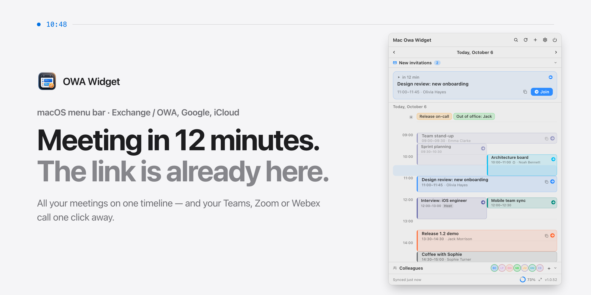
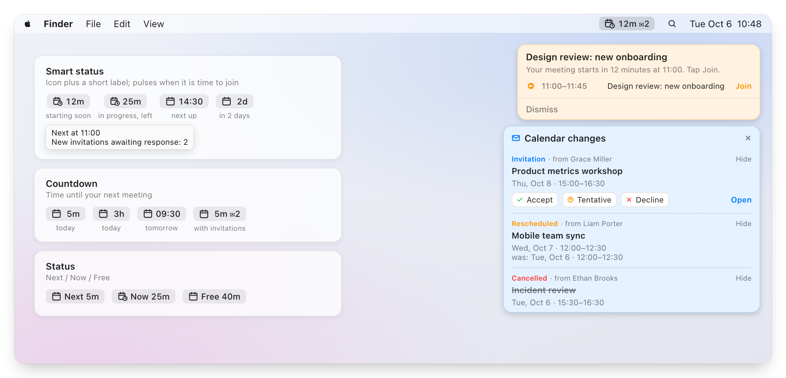
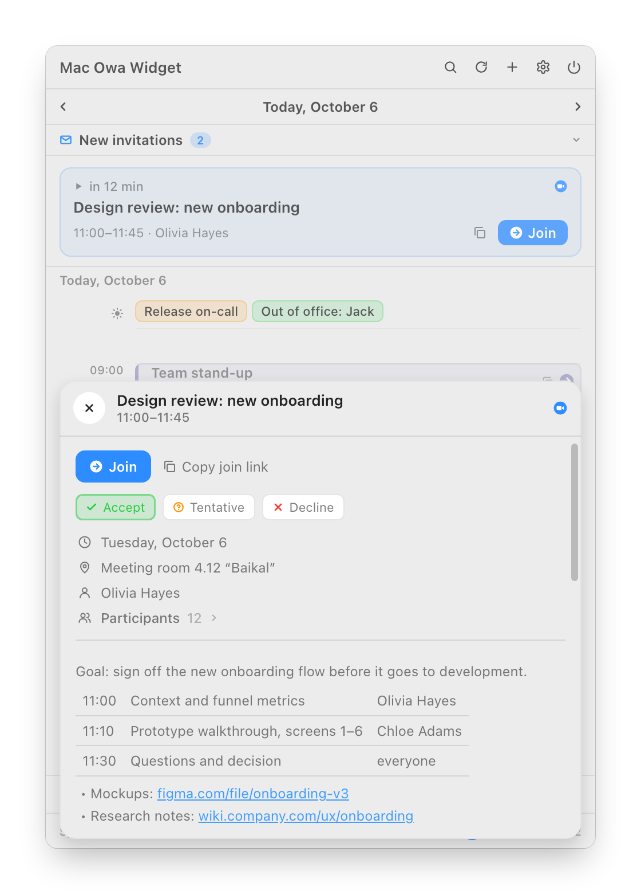
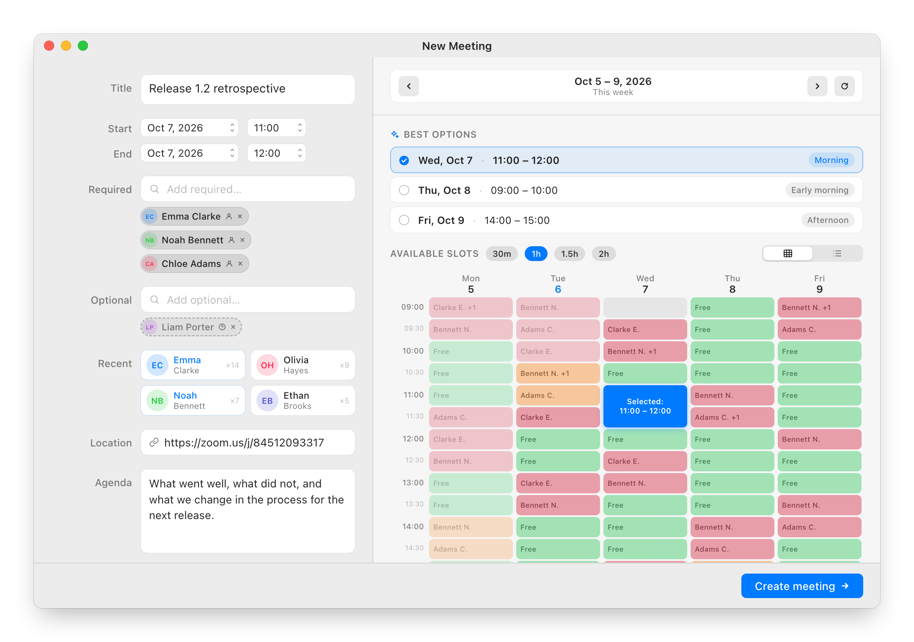
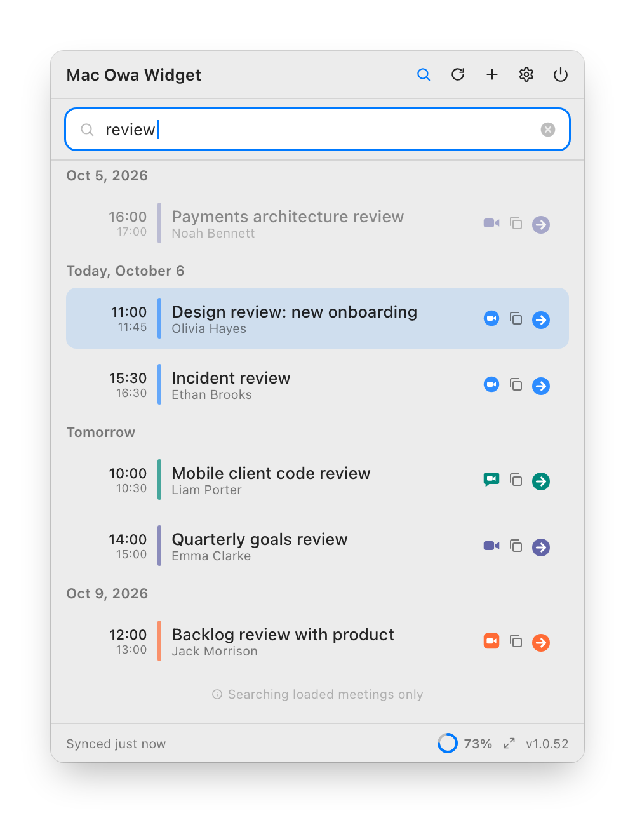
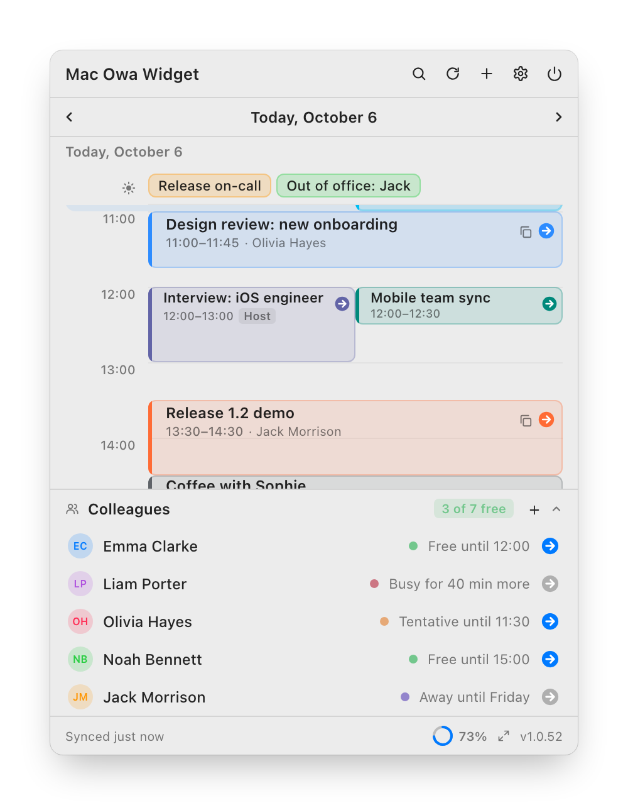
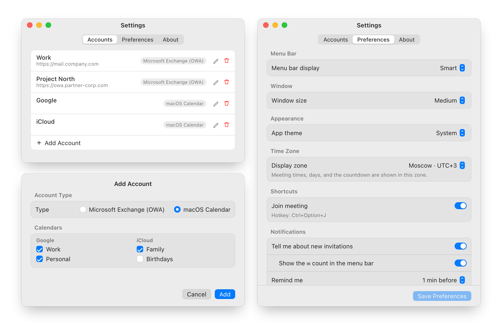

<p align="right"><b>English</b> · <a href="README.ru.md">Русский</a></p>

<picture>
  <source media="(prefers-color-scheme: dark)" srcset="docs/images/hero-en.png">
  
</picture>

[](#requirements)
[](#requirements)
[](DEVELOPMENT.md)
[](https://github.com/ilyabazhenov/mac-owa-widget/releases/latest)
[](LICENSE)

**OWA Widget** lives in the macOS menu bar and keeps your whole workday within reach: Exchange / OWA, Google and iCloud meetings on one timeline, one-click join for Teams, Zoom, Webex, Google Meet and KTalk, invitation replies and a free slot for the next meeting.

**[Download for macOS](https://github.com/ilyabazhenov/mac-owa-widget/releases/latest)** · [Website](https://ilyabazhenov.github.io/mac-owa-widget/) · [Install](#installation) · [FAQ](#faq)

Free and open source. The first launch needs one Terminal command — see [Installation](#installation).

## At a glance

- **Next meeting** — a Join button shows up half an hour before the start and stays while the meeting runs.
- **Overlaps side by side** — parallel meetings never stack; the current half hour is highlighted and the past fades out.
- **All-day, out of the way** — on-call shifts, vacations and trips live in their own strip above the timeline.
- **New invitations** — everything waiting for your answer, right at the top.
- **A week back, a month ahead** — the arrows or a two-finger swipe on the trackpad.
- **Your way** — three window sizes, light or dark theme, your own display time zone.

---

`09:58–10:00 · join`

### The call is in two minutes. No digging for the link.

The app finds the Teams, Zoom, Webex, Google Meet or KTalk link on its own — in the online meeting field, the location or the description. All that's left is to click.

<picture>
  <source media="(prefers-color-scheme: dark)" srcset="docs/images/menubar-en.png">
  
</picture>

- **Smart status** in the menu bar: time until the meeting and until it ends, with a pulse when it's time to join. **Countdown** and **Next / Now / Free** modes are there too.
- A reminder with a **Join** button on the display where your cursor is.
- **Ctrl+Option+J** joins the current meeting from any app; if several start at once, you pick one.
- Moved or cancelled meetings and new invitations show up in a panel you can answer from. The ✉︎ counter in the menu bar keeps track of the unanswered ones.

`11:00–11:45 · agenda`

### The whole agenda, not the first 255 characters.

The meeting card shows the description the way it was written: a timetable stays a table, lists stay lists, `https` links are clickable. Participants and your RSVP live there too.

<p align="center">
  <picture>
    <source media="(prefers-color-scheme: dark)" srcset="docs/images/details-en.png">
    
  </picture>
</p>

- **Accept**, **Tentative** or **Decline** without opening Outlook; your current response is highlighted.
- Required and optional participants; long lists collapse so they don't push the agenda away.
- Copy the title, the join link, or the title with time and link in one go.

`13:30–14:00 · new meeting`

### Find the hour when all five are free.

Add people from the Exchange address book and the grid shows everyone's week, while **Best options** suggests a good slot for each day. Pick 30 min, 1 h, 1.5 h or 2 h and only the windows the meeting fits into remain.

<picture>
  <source media="(prefers-color-scheme: dark)" srcset="docs/images/create-meeting-en.png">
  
</picture>

- Free, tentative, busy and out of office for every attendee, a week at a time.
- Required and optional attendees; frequent contacts are one click away.
- Book time just for yourself, without attendees. Open the window with **+** or **Ctrl+Option+N**.

`16:00–16:15 · search`

### Where was that meeting about the budget?

Search by title, organizer, participants, location and description, a week back and a month ahead. And at the bottom of the window, the colleagues you call most: see who is free and jump into their Teams or Zoom room.

<table>
<tr>
<td width="50%">
<picture>
  <source media="(prefers-color-scheme: dark)" srcset="docs/images/search-en.png">
  
</picture>
</td>
<td width="50%">
<picture>
  <source media="(prefers-color-scheme: dark)" srcset="docs/images/colleagues-en.png">
  
</picture>
</td>
</tr>
</table>

`17:30–18:00 · personal`

### Work Exchange, personal Google, family iCloud.

Several Exchange / OWA servers, including ones behind Windows single sign-on, and any calendar your Mac already syncs. All on one timeline.

<picture>
  <source media="(prefers-color-scheme: dark)" srcset="docs/images/settings-en.png">
  
</picture>

- **Microsoft Exchange / OWA**: Exchange 2016, 2019 and Exchange Online, including servers behind Windows single sign-on (NTLM). Several accounts at once.
- **macOS Calendar**: Google, iCloud, local and other Internet Accounts your Mac syncs. Pick which calendars to show. They are read-only: RSVP, new meetings and Colleagues go through OWA.
- Menu bar mode, window size, theme, display time zone, reminders, the join hotkey and invitation alerts in Settings.

`18:00 · privacy`

### Your calendar stays yours.

- **Passwords in Keychain.** Accounts, the meeting cache and attendee history are encrypted on disk with a key kept in the Keychain.
- **Only your server.** Credentials go where you pointed them; a sign-in redirected elsewhere needs your confirmation.
- **HTTPS and certificate pinning.** A changed certificate shows the old and new fingerprints, so a renewal can be told from an intercept.
- **A log with nothing personal.** The diagnostic log stays on your Mac and holds no meeting titles, addresses, passwords or server responses.

---

## Requirements

| | |
|---|---|
| **macOS** | 13 Ventura or later, Apple Silicon or Intel |
| **Calendar** | Exchange 2016, 2019, Online — and/or Google, iCloud via macOS |
| **Network** | Access to Exchange or a corporate VPN; not needed for Mac calendars |

## Installation

Two minutes, once.

1. Download the macOS `.zip` from the [latest release](https://github.com/ilyabazhenov/mac-owa-widget/releases/latest).
2. Unzip it and move `OWAWidget.app` to `/Applications`.
3. The app has no Apple Developer ID signature, so macOS may block the first launch. Remove the quarantine flag once:

   ```bash
   xattr -dr com.apple.quarantine /Applications/OWAWidget.app
   ```

4. Launch it. The icon appears in the menu bar; there is no Dock icon.

   ```bash
   open /Applications/OWAWidget.app
   ```

The quarantine step is for the first install only. After that [Sparkle](https://sparkle-project.org) installs updates with the **Install** button right in the app window: it downloads the update, verifies its signature and relaunches. Automatic checks can be turned off in **Settings › Preferences › Updates**.

## First setup

Open **Settings** from the menu bar icon, go to **Accounts**, click **+** and pick the account type.

**Microsoft Exchange (OWA)**

1. Enter the server URL, your account and password, and a display name. The server URL is the address of your corporate webmail: `mail.company.com`, `https://owa.company.com` or `https://outlook.company.com/owa`. If your company uses Windows single sign-on, enter the account as `DOMAIN\login` with your PC password.
2. Click **Test Connection**, then **Add**. Connect to VPN first if Exchange is only reachable from the corporate network.

**macOS Calendar (Google, iCloud, local)**

1. Allow access to Calendar when macOS asks.
2. Tick the calendars you want and click **Add**. They come from **System Settings › Internet Accounts**; add a Google or iCloud account there if the list is empty.

Allow notifications when macOS asks, so you get reminders before meetings.

## FAQ

**Where do I find my OWA server address?**
It's the address you open corporate webmail with in the browser. Ask your IT department if you are not sure.

**Can I use it without Exchange?**
Yes. Add a **macOS Calendar** account and the widget shows the calendars your Mac syncs. They are read-only: RSVP, new meetings and Colleagues need Exchange / OWA.

**Why does macOS ask for Calendar access?**
Only to read Google, iCloud and local calendars. If you use Exchange / OWA alone, you can decline it. macOS may ask again after an app update; just confirm.

**Do I need a VPN?**
If Exchange is only reachable from the corporate network, yes: the app needs the same server your browser sees. Google and iCloud calendars don't need it.

**Why is there no Join button for a meeting?**
The button appears when the online meeting field, location or description contains a call link. Check that the organizer added one.

**Why does macOS block the first launch?**
The app is distributed without an Apple Developer ID signature, so Gatekeeper quarantines the first downloaded bundle. Remove the flag once with the command from [Installation](#installation).

## Diagnostics

On every launch OWA Widget writes a short lifecycle log: launch, menu bar icon, account state, sync errors. It holds metadata only — no meeting titles, email addresses or passwords.

```text
~/Library/Application Support/OWAWidget/diagnostic.log           # current session
~/Library/Application Support/OWAWidget/diagnostic.previous.log  # previous session
```

- **The menu bar icon is visible:** right-click it → **Copy diagnostics**. The report lands on the clipboard.
- **The icon is missing:** open the file directly:

  ```bash
  open ~/Library/Application\ Support/OWAWidget/diagnostic.log
  ```

Attach it to a [GitHub issue](https://github.com/ilyabazhenov/mac-owa-widget/issues); it is usually enough to see where launch or sync went wrong.

## Development

Building from source, architecture, screenshots and releases are covered in [DEVELOPMENT.md](DEVELOPMENT.md).

## License

[MIT](LICENSE)
