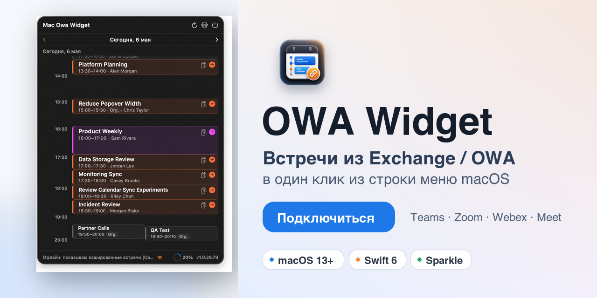

# OWA Widget



[](#требования)
[](DEVELOPMENT.md)
[](https://github.com/ilyabazhenov/mac-owa-widget/releases/latest)
[](LICENSE)

**OWA Widget** показывает ближайшие встречи из Microsoft Exchange / OWA прямо в строке меню macOS и помогает подключаться к Teams, Zoom, Webex, Google Meet и другим звонкам в один клик.

## Что умеет

- Показывает ближайшие встречи в компактном popover из строки меню.
- Отображает день как таймлайн, включая пересекающиеся и параллельные встречи.
- Находит ссылку подключения в поле встречи, локации и описании.
- Распознает Teams, Zoom, Webex, Google Meet, KTalk и другие платформы.
- Показывает локальные уведомления до начала встречи.
- Поддерживает несколько Exchange / OWA аккаунтов.
- Хранит пароли только в macOS Keychain.
- Устанавливает последующие обновления внутри приложения через Sparkle.

## Требования

| Что нужно | Версия |
|---|---|
| macOS | 13 Ventura или новее |
| Exchange / OWA | Exchange 2016, 2019 или Exchange Online |
| Доступ к серверу | Напрямую или через корпоративный VPN |

## Установка

1. Откройте [последний релиз](https://github.com/ilyabazhenov/mac-owa-widget/releases/latest).
2. Скачайте `.zip` архив для macOS.
3. Распакуйте архив и перенесите `OWAWidget.app` в `/Applications`.
4. Если macOS блокирует первый запуск, один раз снимите quarantine-атрибут:

```bash
xattr -dr com.apple.quarantine /Applications/OWAWidget.app
```

5. Запустите приложение:

```bash
open /Applications/OWAWidget.app
```

После запуска OWA Widget появится в строке меню. Иконки в Dock нет, приложение работает только как menu bar app.

## Первый запуск

1. Нажмите на иконку OWA Widget в строке меню.
2. Откройте **Настройки**.
3. На вкладке **Аккаунты** нажмите **+**.
4. Укажите имя аккаунта, URL OWA-сервера, email и пароль.
5. Нажмите **Проверить подключение**.
6. Сохраните аккаунт и разрешите уведомления, когда macOS спросит об этом.

URL OWA-сервера обычно совпадает с адресом корпоративной почты в браузере:

```text
https://mail.company.com
https://owa.company.com
https://outlook.company.com
```

Если Exchange доступен только из внутренней сети, перед синхронизацией подключитесь к корпоративному VPN.

## Обновления

OWA Widget использует [Sparkle](https://sparkle-project.org) для автоматических обновлений.

- После первой установки новые версии больше не нужно скачивать и распаковывать вручную.
- Когда доступно обновление, в popover появляется кнопка **Установить**.
- Приложение скачивает обновление, проверяет подпись, заменяет bundle и перезапускается.
- Автопроверку обновлений можно настроить в разделе обновлений окна настроек.

Команда `xattr -dr com.apple.quarantine /Applications/OWAWidget.app` нужна только при первой установке. Последующие обновления ставятся через Sparkle автоматически.

## Частые вопросы

**Где взять URL OWA-сервера?**

Используйте адрес, по которому вы открываете корпоративную почту в браузере. Если сомневаетесь, спросите IT-отдел.

**Нужен ли VPN?**

Если Exchange / OWA доступен только из корпоративной сети, да. Приложение должно видеть тот же сервер, что и браузер.

**Где хранится пароль?**

Пароль сохраняется в macOS Keychain. Он не хранится в открытом виде в файлах репозитория или настроек.

**Почему macOS блокирует первый запуск?**

Приложение распространяется без Apple Developer ID подписи, поэтому Gatekeeper может пометить первый скачанный bundle как quarantined. Снимите quarantine-атрибут один раз командой из раздела установки.

**Почему у встречи нет кнопки подключения?**

Кнопка появляется, когда приложение находит ссылку на звонок в данных встречи. Проверьте, что организатор добавил ссылку в описание, локацию или отдельное поле онлайн-встречи.

## Разработка

Информация для разработчиков вынесена в [DEVELOPMENT.md](DEVELOPMENT.md): сборка из исходников, XcodeGen, архитектура, релизная упаковка и GitHub release flow.

## English

**OWA Widget** is a macOS menu bar app that shows upcoming meetings from Microsoft Exchange / OWA and helps you join Teams, Zoom, Webex, Google Meet, and other calls in one click.

### Features

- Compact menu bar popover with upcoming meetings.
- Day timeline with overlapping and parallel meetings.
- Join link detection in the meeting field, location, and body.
- Platform recognition for Teams, Zoom, Webex, Google Meet, KTalk, and more.
- Local notifications before meetings start.
- Multiple Exchange / OWA accounts.
- Password storage in macOS Keychain.
- In-app automatic updates through Sparkle.

### Requirements

| Requirement | Version |
|---|---|
| macOS | 13 Ventura or later |
| Exchange / OWA | Exchange 2016, 2019, or Exchange Online |
| Network access | Direct access or corporate VPN |

### Installation

1. Open the [latest release](https://github.com/ilyabazhenov/mac-owa-widget/releases/latest).
2. Download the macOS `.zip` archive.
3. Extract it and move `OWAWidget.app` to `/Applications`.
4. If macOS blocks the first launch, remove the quarantine attribute once:

```bash
xattr -dr com.apple.quarantine /Applications/OWAWidget.app
```

5. Launch the app:

```bash
open /Applications/OWAWidget.app
```

OWA Widget will appear in the macOS menu bar. It has no Dock icon.

### First setup

1. Click the OWA Widget menu bar icon.
2. Open **Settings**.
3. Go to the **Account** tab and click **+**.
4. Enter display name, OWA server URL, email, and password.
5. Click **Test Connection**.
6. Save the account and allow notifications when macOS asks.

Your OWA server URL is usually the same address you use for corporate webmail:

```text
https://mail.company.com
https://owa.company.com
https://outlook.company.com
```

If Exchange is only available inside the corporate network, connect to VPN before syncing.

### Updates

OWA Widget uses [Sparkle](https://sparkle-project.org) for automatic updates.

- After the first install, you do not need to download and unpack every new release manually.
- When an update is available, the popover shows an **Install** button.
- The app downloads, verifies, swaps the bundle, and relaunches automatically.
- Auto-checks can be configured in **Settings -> Preferences -> Updates**.

The quarantine command is required only for the first install. All later updates are installed automatically through Sparkle.

### FAQ

**Where do I find my OWA server URL?**

Use the same address you open corporate webmail with in the browser. Ask your IT department if you are not sure.

**Do I need VPN?**

If Exchange / OWA is only available from the corporate network, yes. The app must be able to reach the same server as your browser.

**Where is my password stored?**

The password is stored in macOS Keychain. It is not stored as plain text in repository or settings files.

**Why does macOS block the first launch?**

The app is distributed without an Apple Developer ID signature, so Gatekeeper may mark the first downloaded bundle as quarantined. Remove the quarantine attribute once using the command above.

**Why is there no Join button for a meeting?**

The button appears when the app finds a meeting link in the event data. Check that the organizer included the link in the body, location, or online meeting field.

### Development

Developer documentation lives in [DEVELOPMENT.md](DEVELOPMENT.md): source builds, XcodeGen, architecture, release packaging, and the GitHub release flow.

## License

[MIT](LICENSE)
