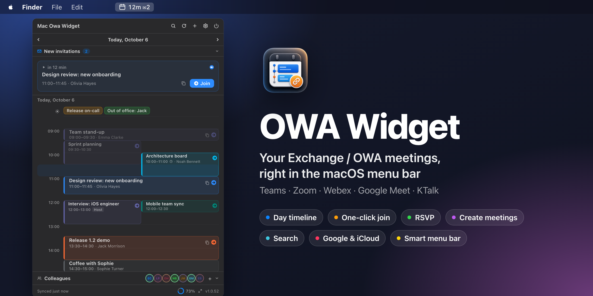
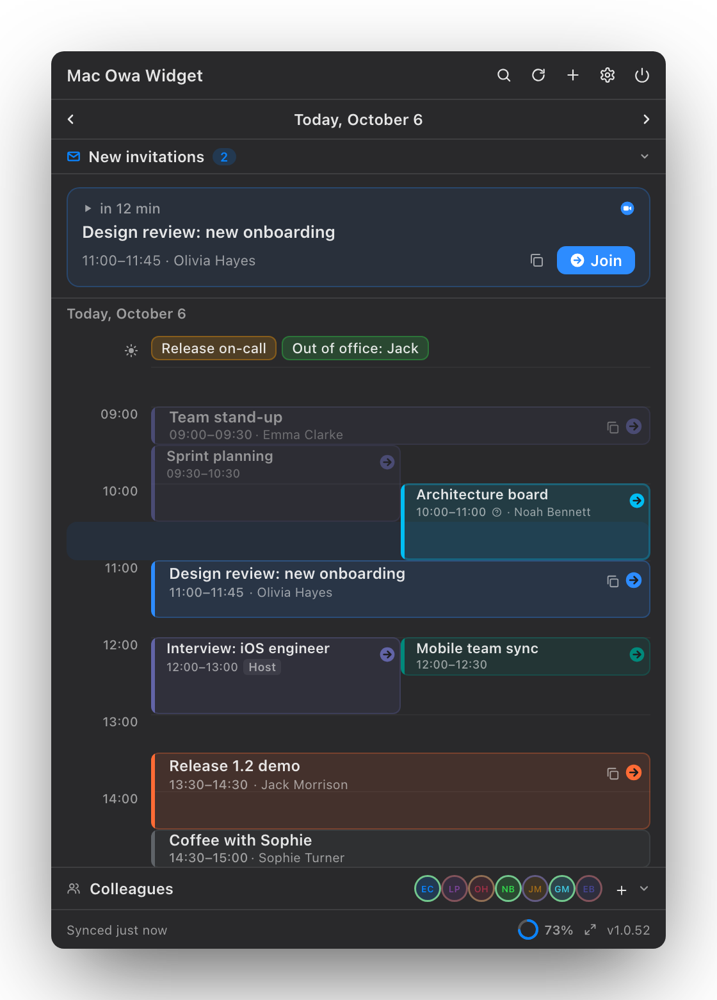
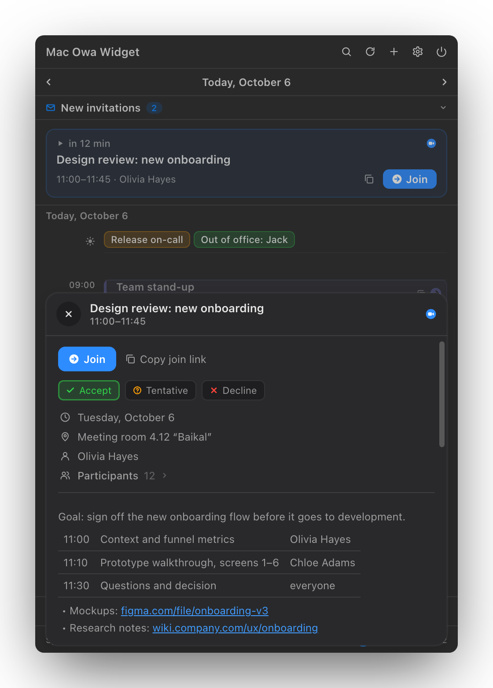
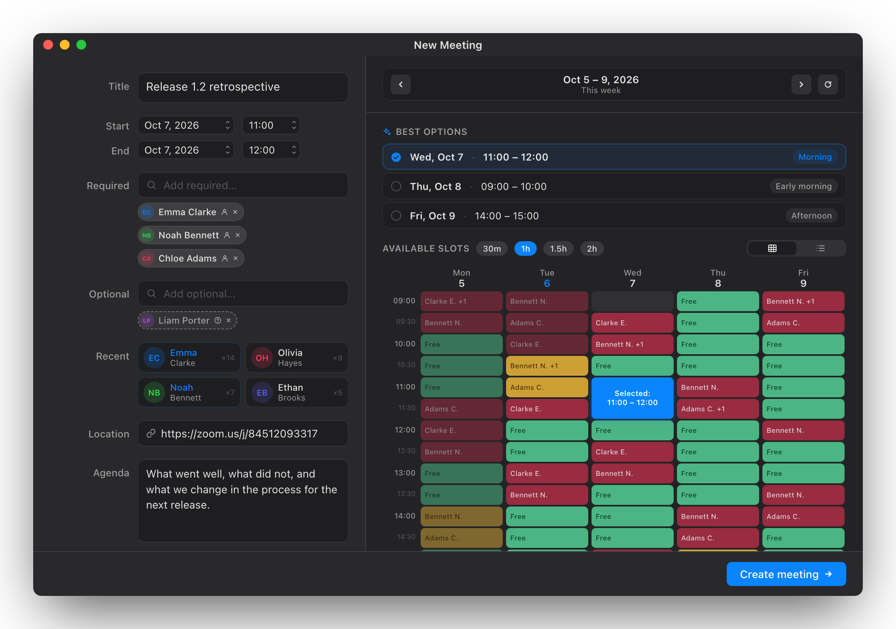
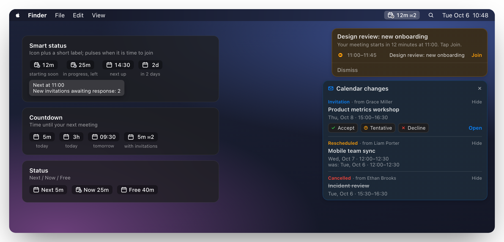
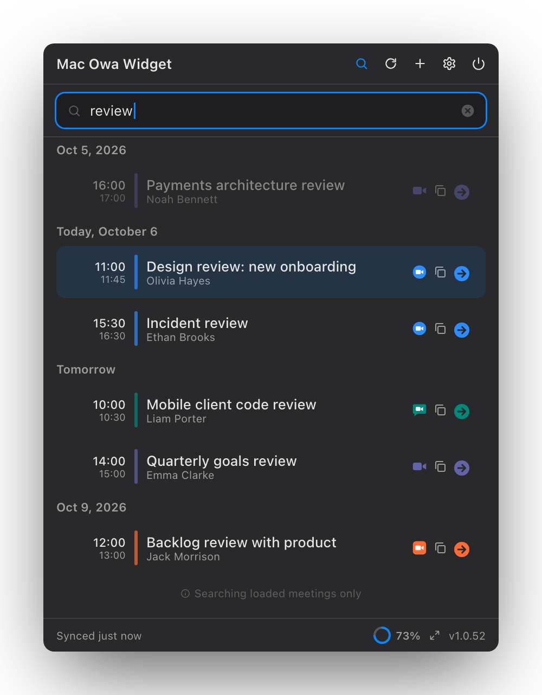
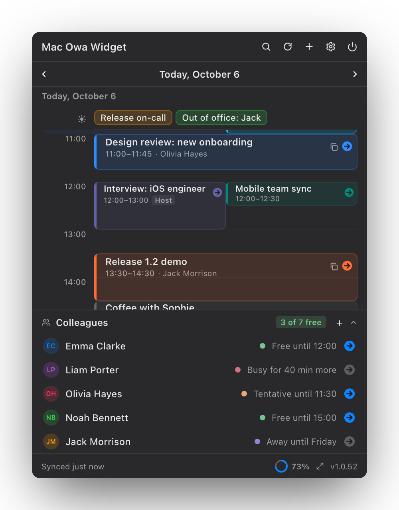
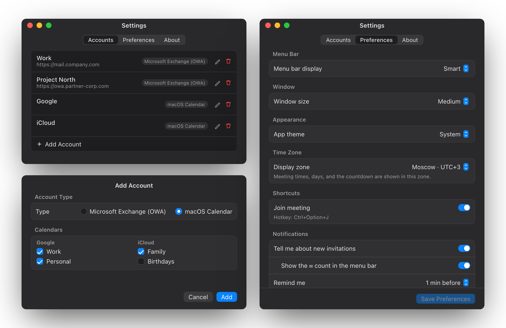

<p align="right"><b>English</b> · <a href="README.ru.md">Русский</a></p>

# OWA Widget



[](#requirements)
[](#requirements)
[](DEVELOPMENT.md)
[](https://github.com/ilyabazhenov/mac-owa-widget/releases/latest)
[](LICENSE)

**OWA Widget** is a macOS menu bar app for your meetings. It shows your day from Microsoft Exchange / OWA and from any calendar your Mac already syncs (Google, iCloud, local), and joins Teams, Zoom, Webex, Google Meet, KTalk and other calls in one click. From the same popover you can answer invitations, search meetings and book new ones against your colleagues' availability.

[Download the latest release](https://github.com/ilyabazhenov/mac-owa-widget/releases/latest) · [Website](https://ilyabazhenov.github.io/mac-owa-widget/) · [Install](#installation) · [FAQ](#faq)

## Features

### Your day at a glance



- The day as a timeline: overlapping meetings sit side by side, the current half hour is highlighted, and past meetings fade out.
- A **next meeting** banner with a countdown and a **Join** button, shown 30 minutes before the start and while the meeting runs.
- All-day events (on-call, vacations, trips) live in a pinned strip above the timeline instead of crowding it.
- Browse a week back and a month ahead with the arrows or a two-finger swipe on the trackpad.
- Meetings from all accounts in one timeline: several Exchange / OWA servers plus Google and iCloud calendars.
- Three window sizes (compact, medium, large), light, dark or system theme, and a display time zone of your choice.

<br clear="right">

### Everything about a meeting in one card



- The full agenda, not the 255-character preview Exchange returns: tables stay tables, lists keep their nesting, and `https` links are clickable.
- Answer the invitation right there: **Accept**, **Tentative** or **Decline**; your current response is highlighted.
- Participants split into required and optional; long lists collapse so they don't push the agenda away.
- Copy the title, the join link, or the title with time and link in one go.

<br clear="right">

### Create meetings against real availability



- Find people in the Exchange address book; add them as required or optional. Frequent contacts are one click away.
- The availability grid shows the whole week for everyone: free, tentative, busy and out of office.
- **Best options** suggests one good slot per day; pick 30 min, 1 h, 1.5 h or 2 h and the grid only offers windows that fit.
- Book time for yourself only, without attendees. Open the window with the **+** button or **Ctrl+Option+N**.

### The menu bar that tells you what's next



- **Smart status**: an icon and a short label, pulsing when it's time to join. **Countdown** and **Next / Now / Free** modes are there too.
- On-screen reminders with a **Join** button appear on the display where your cursor is.
- **Calendar changes**: new invitations, rescheduled and cancelled meetings pop up in a panel you can answer from. The ✉︎ counter in the menu bar keeps track of unanswered ones.
- **Ctrl+Option+J** joins the current meeting from any app; if several start at once, you pick one.
- A warning badge on the icon when sync fails, with the reason in the tooltip.

### Search and colleagues

<table>
<tr>
<td width="50%"></td>
<td width="50%"></td>
</tr>
<tr>
<td valign="top">Search by title, organizer, participants, location and description across everything loaded, from a week back to a month ahead. Results are grouped by day with a join button on each row.</td>
<td valign="top">Keep the people you call most at the bottom of the popover: see who is free, busy or away right now, and jump into their personal Teams or Zoom room.</td>
</tr>
</table>

### Exchange, Google and iCloud side by side



- **Microsoft Exchange / OWA**: Exchange 2016, 2019 and Exchange Online, including servers that moved to Windows single sign-on (NTLM). Several accounts at once.
- **macOS Calendar**: any calendar your Mac already syncs (Google, iCloud, local, other Internet Accounts). Pick which calendars to show; their meetings appear next to OWA ones, join links included.
- Settings for the menu bar mode, window size, theme, display time zone, reminders, the join hotkey and invitation alerts.

### Private by design

- Passwords live in the macOS Keychain. The account list, meeting cache and attendee history are encrypted on disk with a key stored in the Keychain.
- HTTPS only, with per-host certificate pinning. An untrusted or changed certificate, or a sign-in redirected to another host, needs your explicit confirmation.
- Credentials go only to the server you configured. Diagnostic logs contain no meeting titles, addresses, passwords or server responses.
- Updates are signed and installed in-app through [Sparkle](https://sparkle-project.org).

## Requirements

| Requirement | Version |
|---|---|
| macOS | 13 Ventura or later, Apple Silicon or Intel |
| Calendar | Exchange 2016, 2019 or Exchange Online, and/or calendars synced by macOS (Google, iCloud) |
| Network access | Direct access to Exchange or a corporate VPN (not needed for macOS calendars) |

## Installation

1. Open the [latest release](https://github.com/ilyabazhenov/mac-owa-widget/releases/latest).
2. Download the macOS `.zip` archive.
3. Extract it and move `OWAWidget.app` to `/Applications`.
4. If macOS blocks the first launch, remove the quarantine attribute once:

```bash
xattr -dr com.apple.quarantine /Applications/OWAWidget.app
```

5. Launch the app:

```bash
open /Applications/OWAWidget.app
```

OWA Widget appears in the menu bar. It has no Dock icon.

The quarantine command is needed only for the first install. All later updates are installed automatically through Sparkle.

## First setup

1. Click the OWA Widget icon in the menu bar and open **Settings**.
2. On the **Accounts** tab click **+** and choose the account type.

**Microsoft Exchange (OWA)**

3. Enter the server URL, your account and password, and a display name.
   - The server URL is usually the address of your corporate webmail: `mail.company.com`, `https://owa.company.com` or `https://outlook.company.com/owa`.
   - If your company signs in with Windows single sign-on, enter the account as `DOMAIN\login` with the password you use for your PC.
4. Click **Test Connection**, then **Add**. Connect to VPN first if Exchange is only reachable from the corporate network.

**macOS Calendar (Google, iCloud, local)**

3. Allow access to Calendar when macOS asks.
4. Tick the calendars you want to see and click **Add**. Calendars come from **System Settings › Internet Accounts**; add a Google or iCloud account there if the list is empty.

Allow notifications when macOS asks, so you get reminders before meetings.

## Updates

OWA Widget uses [Sparkle](https://sparkle-project.org) for automatic updates.

- When an update is available, the popover shows an **Install** button.
- The app downloads the update, verifies its signature, swaps the bundle and relaunches.
- Automatic checks can be turned off in **Settings › Preferences › Updates**.

## FAQ

**Where do I find my OWA server URL?**

Use the address you open corporate webmail with in the browser. Ask your IT department if you are not sure.

**Do I need VPN?**

For Exchange / OWA that is only reachable from the corporate network, yes: the app must reach the same server as your browser. Google and iCloud calendars work without it.

**Can I use it without Exchange?**

Yes. Add a **macOS Calendar** account and the widget shows the calendars your Mac syncs. These calendars are read-only in the app: answering invitations, creating meetings and the Colleagues section need an Exchange / OWA account.

**Why does macOS ask for Calendar access?**

That permission is needed only to read Google, iCloud and local calendars. If you use only Exchange / OWA, you can decline it. macOS may ask again after an app update; just confirm.

**Where is my password stored?**

In the macOS Keychain. It is never written to settings or other files in plain text.

**Why does macOS block the first launch?**

The app is distributed without an Apple Developer ID signature, so Gatekeeper may quarantine the first downloaded bundle. Remove the quarantine attribute once with the command from [Installation](#installation).

**Why is there no Join button for a meeting?**

The button appears when the app finds a call link in the meeting: the online meeting field, the location or the description. Check that the organizer added the link.

## Diagnostics

On every launch OWA Widget writes a short lifecycle log (launch, menu bar icon, account state, sync errors). It contains no meeting titles, email addresses or passwords, only metadata.

```text
~/Library/Application Support/OWAWidget/diagnostic.log           # current session
~/Library/Application Support/OWAWidget/diagnostic.previous.log  # previous session
```

- **The menu bar icon is visible:** right-click it → **Copy diagnostics**. The report lands on the clipboard.
- **The icon is missing:** in Finder press `⌘⇧G` and paste the path above, or run:

```bash
open ~/Library/Application\ Support/OWAWidget/diagnostic.log
```

Attach the contents to your bug report; it is usually enough to see where launch or sync went wrong.

## Development

Building from source, architecture, screenshots and releases are covered in [DEVELOPMENT.md](DEVELOPMENT.md).

## License

[MIT](LICENSE)
