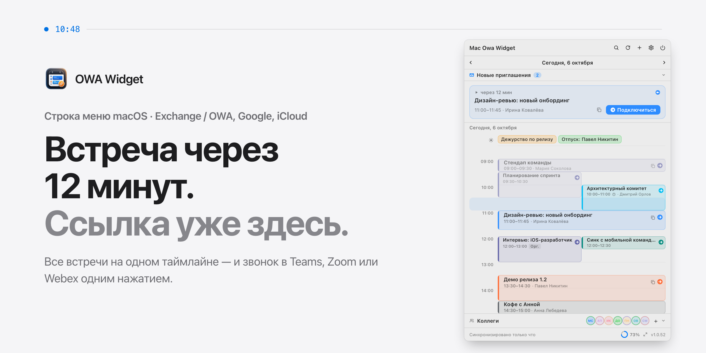
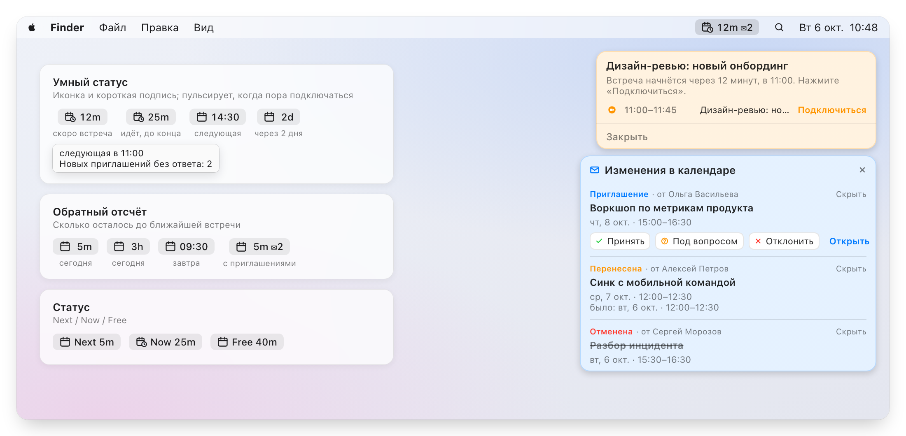
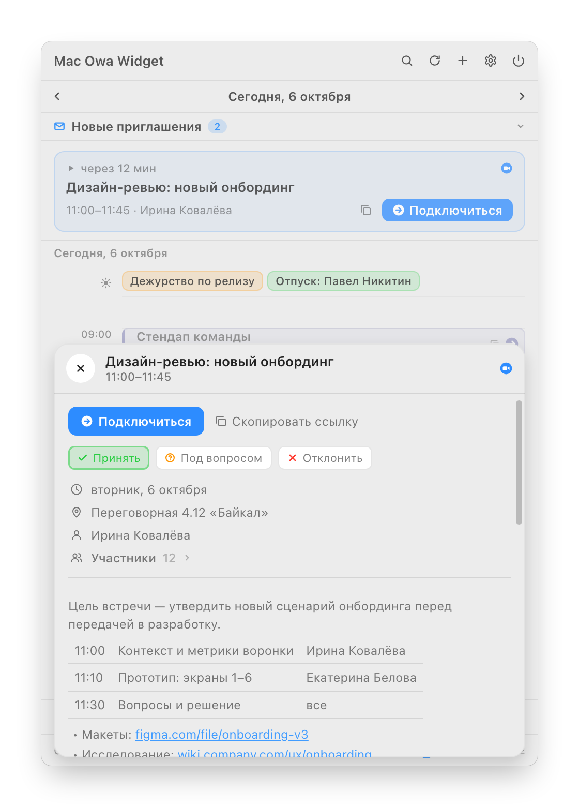
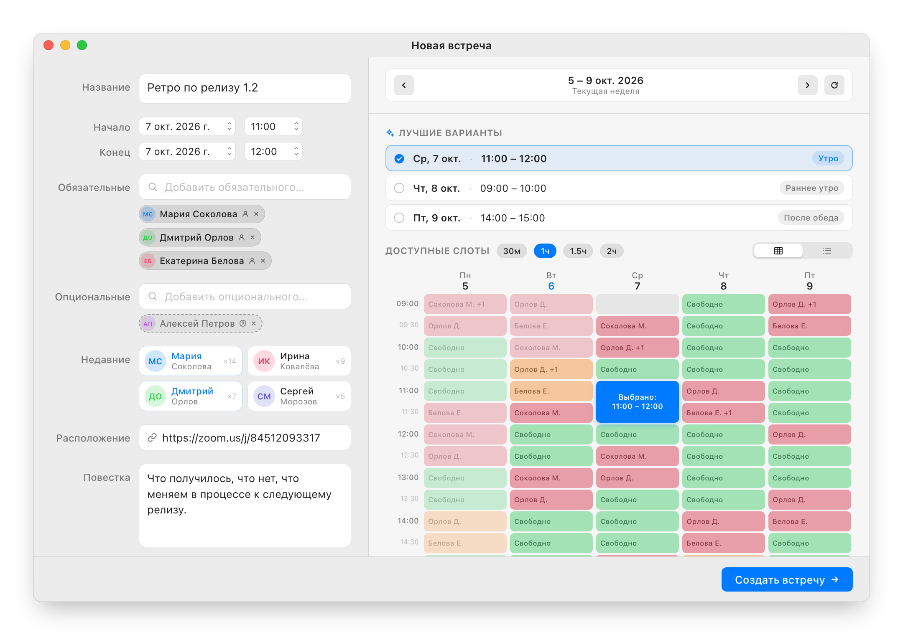
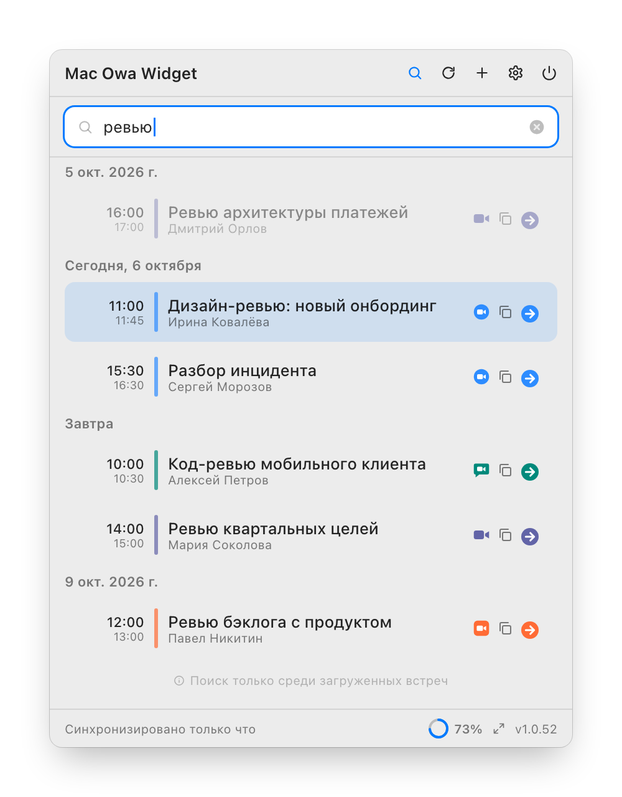
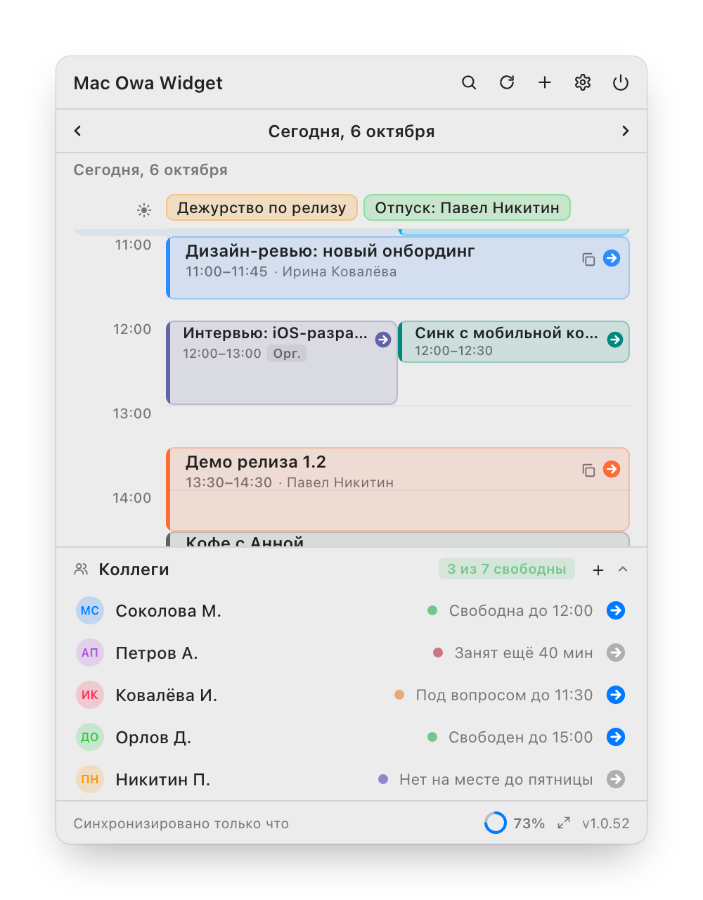
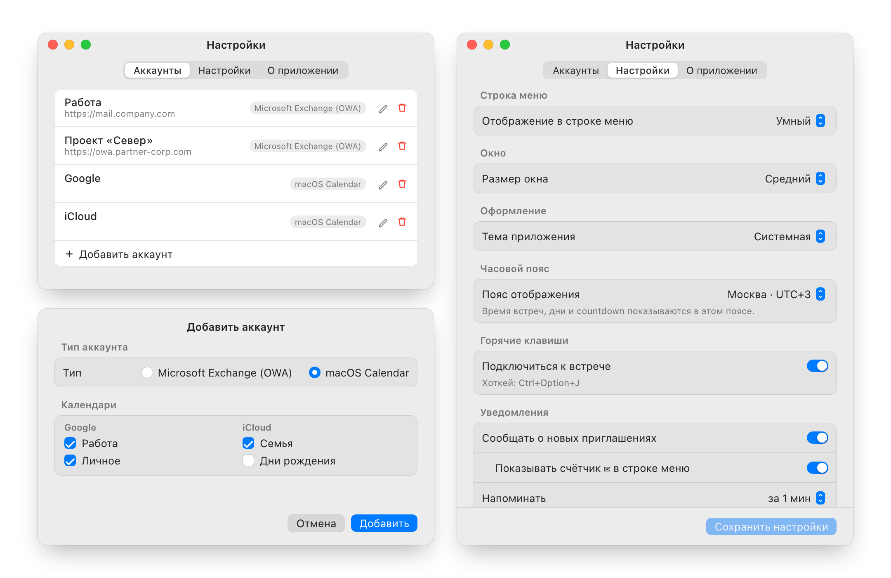

<p align="right"><a href="README.md">English</a> · <b>Русский</b></p>

<picture>
  <source media="(prefers-color-scheme: dark)" srcset="docs/images/hero-ru.png">
  
</picture>

[](#требования)
[](#требования)
[](DEVELOPMENT.md)
[](https://github.com/ilyabazhenov/mac-owa-widget/releases/latest)
[](LICENSE)

**OWA Widget** живёт в строке меню macOS и держит под рукой весь рабочий день: встречи из Exchange / OWA, Google и iCloud на одном таймлайне, подключение к Teams, Zoom, Webex, Google Meet и KTalk одним нажатием, ответы на приглашения и поиск времени для новой встречи.

**[Скачать для macOS](https://github.com/ilyabazhenov/mac-owa-widget/releases/latest)** · [Сайт](https://ilyabazhenov.github.io/mac-owa-widget/) · [Установка](#установка) · [Частые вопросы](#частые-вопросы)

Бесплатно и с открытым кодом. При первом запуске нужна одна команда в Терминале — см. [Установка](#установка).

## Коротко

- **Ближайшая встреча** — кнопка «Подключиться» появляется за полчаса до начала и остаётся, пока встреча идёт.
- **Пересечения рядом** — параллельные встречи не наезжают друг на друга, текущие полчаса подсвечены, прошедшее приглушено.
- **Весь день — отдельно** — дежурства, отпуска и командировки собраны в полосу над таймлайном.
- **Новые приглашения** — всё, что ждёт вашего ответа, прямо наверху.
- **Неделя назад и месяц вперёд** — стрелками или свайпом двумя пальцами по трекпаду.
- **Под себя** — три размера окна, светлая или тёмная тема, свой часовой пояс отображения.

---

`09:58–10:00 · подключение`

### Звонок через две минуты. Ссылку не нужно искать в письме.

Приложение само находит ссылку на Teams, Zoom, Webex, Google Meet или KTalk — в поле онлайн-встречи, в месте или в описании. Остаётся нажать.

<picture>
  <source media="(prefers-color-scheme: dark)" srcset="docs/images/menubar-ru.png">
  
</picture>

- **Умный статус** в строке меню: сколько до встречи и сколько до её конца, а когда пора подключаться — пульсация. Есть и режимы **обратного отсчёта** и **Next / Now / Free**.
- Напоминание с кнопкой **Подключиться** на том мониторе, где сейчас курсор.
- **Ctrl+Option+J** подключает к текущей встрече из любого приложения; если стартует несколько, предложит выбрать.
- Переносы, отмены и новые приглашения приходят в панель, из которой можно сразу ответить. Счётчик ✉︎ в строке меню показывает, сколько приглашений ждут ответа.

`11:00–11:45 · повестка`

### Повестка целиком, а не первые 255 символов.

Карточка встречи показывает описание так, как его написали: таблица тайминга остаётся таблицей, списки — списками, `https`-ссылки кликабельны. Там же — участники и ответ на приглашение.

<p align="center">
  <picture>
    <source media="(prefers-color-scheme: dark)" srcset="docs/images/details-ru.png">
    
  </picture>
</p>

- **Принять**, **Под вопросом** или **Отклонить** — не открывая Outlook; текущий ответ подсвечен.
- Обязательные и необязательные участники; длинный список сворачивается и не вытесняет повестку.
- Копирование названия, ссылки на звонок или сразу названия со временем и ссылкой.

`13:30–14:00 · новая встреча`

### Найти час, когда свободны все пятеро.

Добавьте участников из адресной книги Exchange — сетка покажет занятость каждого на неделю, а **Лучшие варианты** предложат удачный слот на каждый день. Выберите 30 мин, 1 ч, 1.5 ч или 2 ч, и останутся только окна, куда встреча помещается.

<picture>
  <source media="(prefers-color-scheme: dark)" srcset="docs/images/create-meeting-ru.png">
  
</picture>

- Свободно, под вопросом, занято и вне офиса — по каждому участнику, на неделю вперёд.
- Обязательные и необязательные участники, частые контакты под рукой.
- Можно забронировать время только для себя, без участников. Окно открывается кнопкой **+** или сочетанием **Ctrl+Option+N**.

`16:00–16:15 · поиск`

### Где была та встреча про бюджет?

Поиск по названию, организатору, участникам, месту и описанию — неделя назад и месяц вперёд. А внизу окна — коллеги, с которыми вы созваниваетесь чаще всего: видно, кто свободен, и можно сразу зайти в его комнату Teams или Zoom.

<table>
<tr>
<td width="50%">
<picture>
  <source media="(prefers-color-scheme: dark)" srcset="docs/images/search-ru.png">
  
</picture>
</td>
<td width="50%">
<picture>
  <source media="(prefers-color-scheme: dark)" srcset="docs/images/colleagues-ru.png">
  
</picture>
</td>
</tr>
</table>

`17:30–18:00 · личное`

### Рабочий Exchange, личный Google, семейный iCloud.

Несколько серверов Exchange / OWA, включая переход на единый вход Windows, и любые календари, которые уже синхронизирует ваш Mac. Всё на одном таймлайне.

<picture>
  <source media="(prefers-color-scheme: dark)" srcset="docs/images/settings-ru.png">
  
</picture>

- **Microsoft Exchange / OWA**: Exchange 2016, 2019 и Exchange Online, в том числе серверы с единым входом Windows (NTLM). Несколько аккаунтов одновременно.
- **Календарь macOS**: Google, iCloud, локальные и другие учётные записи интернета, которые синхронизирует Mac. Выберите нужные календари. Они только для чтения: ответы, создание встреч и «Коллеги» работают через OWA.
- В настройках — режим строки меню, размер окна, тема, часовой пояс, напоминания, хоткей подключения и уведомления о приглашениях.

`18:00 · приватность`

### Ваш календарь остаётся вашим.

- **Пароли в связке ключей.** Аккаунты, кэш встреч и история участников зашифрованы на диске ключом из связки ключей.
- **Только ваш сервер.** Учётные данные уходят туда, куда вы указали; вход, перенаправленный на другой адрес, требует вашего подтверждения.
- **HTTPS и привязка сертификата.** Сменившийся сертификат покажет старый и новый отпечаток, чтобы замену можно было отличить от подмены.
- **Лог без личного.** Диагностический лог лежит у вас на Mac и не содержит названий встреч, адресов, паролей и ответов сервера.

---

## Требования

| | |
|---|---|
| **macOS** | 13 Ventura и новее, Apple Silicon или Intel |
| **Календарь** | Exchange 2016, 2019, Online — и/или Google, iCloud через macOS |
| **Сеть** | Доступ к Exchange или корпоративный VPN; календарям Mac не нужен |

## Установка

Две минуты, один раз.

1. Скачайте `.zip` для macOS из [последнего релиза](https://github.com/ilyabazhenov/mac-owa-widget/releases/latest).
2. Распакуйте и перенесите `OWAWidget.app` в `/Applications`.
3. У приложения нет подписи Apple Developer ID, поэтому при первом запуске macOS может его заблокировать. Один раз снимите карантин:

   ```bash
   xattr -dr com.apple.quarantine /Applications/OWAWidget.app
   ```

4. Запустите. Иконка появится в строке меню, в Dock её нет.

   ```bash
   open /Applications/OWAWidget.app
   ```

Карантин снимается только при первой установке. Дальше обновления ставит [Sparkle](https://sparkle-project.org) — кнопкой **Установить** прямо в окне приложения: скачивает обновление, проверяет подпись и перезапускает приложение. Автопроверку можно отключить в **Настройки › Настройки › Обновления**.

## Первый запуск

Откройте **Настройки** из иконки в строке меню, перейдите в **Аккаунты**, нажмите **+** и выберите тип аккаунта.

**Microsoft Exchange (OWA)**

1. Укажите URL сервера, учётную запись, пароль и название аккаунта. URL — это адрес корпоративной почты в браузере: `mail.company.com`, `https://owa.company.com` или `https://outlook.company.com/owa`. Если в компании единый вход Windows, учётная запись указывается как `ДОМЕН\логин` с паролем от компьютера.
2. Нажмите **Проверить подключение**, затем **Добавить**. Если Exchange доступен только из внутренней сети, сначала подключитесь к VPN.

**Календарь macOS (Google, iCloud, локальные)**

1. Разрешите доступ к Календарю, когда macOS спросит.
2. Отметьте нужные календари и нажмите **Добавить**. Они берутся из **Системные настройки › Учётные записи интернета**; если список пуст, добавьте туда аккаунт Google или iCloud.

Разрешите уведомления, когда macOS спросит, чтобы получать напоминания перед встречами.

## Частые вопросы

**Где взять адрес OWA-сервера?**
Это адрес, по которому вы открываете корпоративную почту в браузере. Если сомневаетесь, спросите IT-отдел.

**Можно ли пользоваться без Exchange?**
Да. Добавьте аккаунт **macOS Calendar**, и виджет покажет календари, которые синхронизирует ваш Mac. Они только для чтения: ответы на приглашения, создание встреч и «Коллеги» работают с Exchange / OWA.

**Зачем macOS спрашивает доступ к Календарю?**
Только чтобы читать календари Google, iCloud и локальные. Если у вас только Exchange / OWA, разрешение можно не давать. После обновления приложения macOS может спросить снова — достаточно подтвердить.

**Нужен ли VPN?**
Если Exchange доступен только из корпоративной сети — да: приложение должно видеть тот же сервер, что и браузер. Календарям Google и iCloud VPN не нужен.

**Почему у встречи нет кнопки подключения?**
Кнопка появляется, когда в поле онлайн-встречи, месте или описании есть ссылка на звонок. Проверьте, что организатор её добавил.

**Почему macOS блокирует первый запуск?**
Приложение распространяется без подписи Apple Developer ID, поэтому Gatekeeper помечает первый скачанный bundle карантином. Снимите его один раз командой из раздела [Установка](#установка).

## Диагностика

При каждом запуске OWA Widget пишет короткий лог жизненного цикла: запуск, иконка в строке меню, состояние аккаунтов, ошибки синхронизации. В нём только метаданные — без названий встреч, email-адресов и паролей.

```text
~/Library/Application Support/OWAWidget/diagnostic.log           # текущая сессия
~/Library/Application Support/OWAWidget/diagnostic.previous.log  # предыдущая сессия
```

- **Иконка в строке меню видна:** правый клик по ней → **Скопировать диагностику**. Отчёт окажется в буфере обмена.
- **Иконки нет:** откройте файл напрямую:

  ```bash
  open ~/Library/Application\ Support/OWAWidget/diagnostic.log
  ```

Приложите его к [issue на GitHub](https://github.com/ilyabazhenov/mac-owa-widget/issues) — обычно этого достаточно, чтобы понять, где запуск или синхронизация пошли не так.

## Разработка

Сборка из исходников, архитектура, скриншоты и релизы описаны в [DEVELOPMENT.md](DEVELOPMENT.md).

## Лицензия

[MIT](LICENSE)
