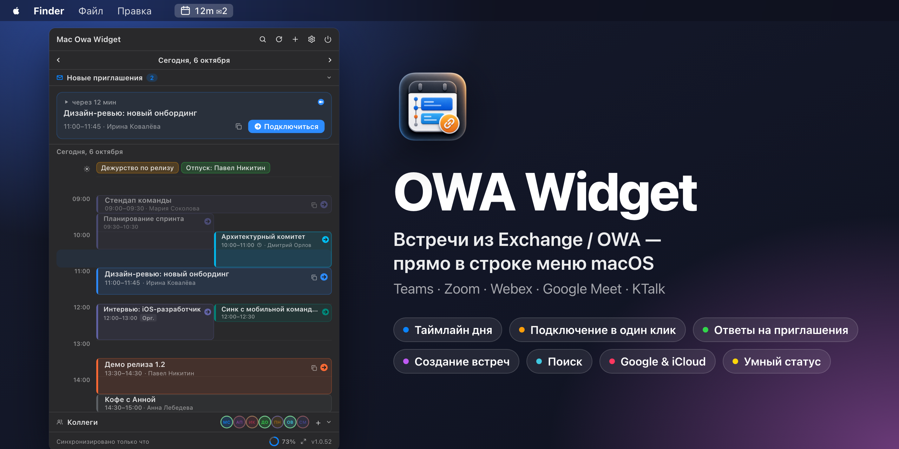
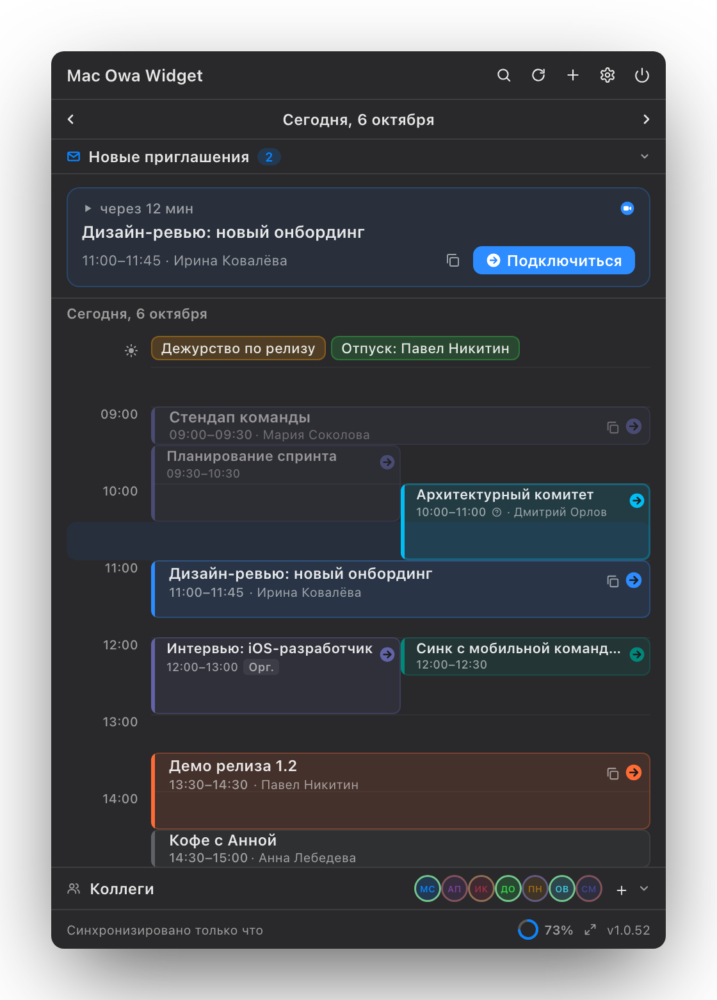
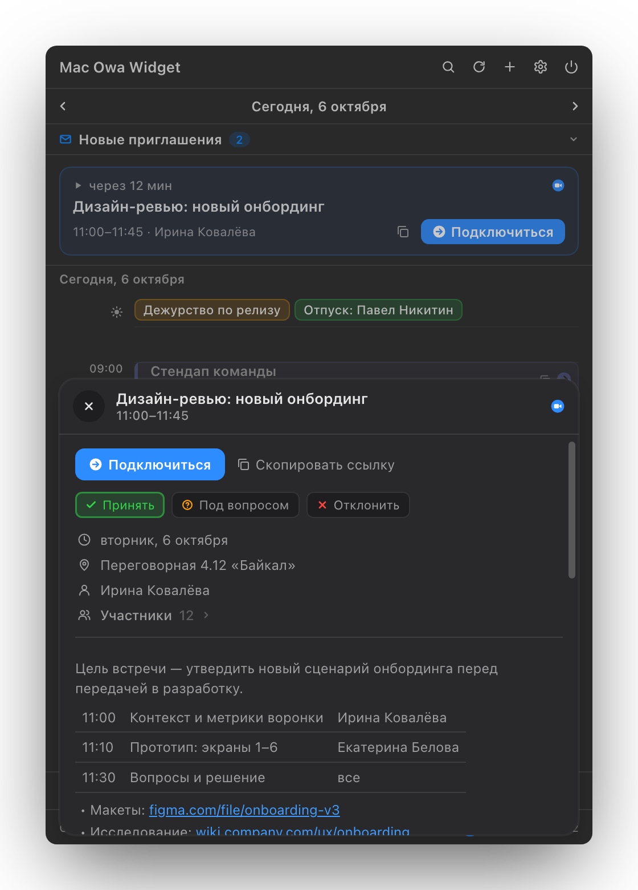
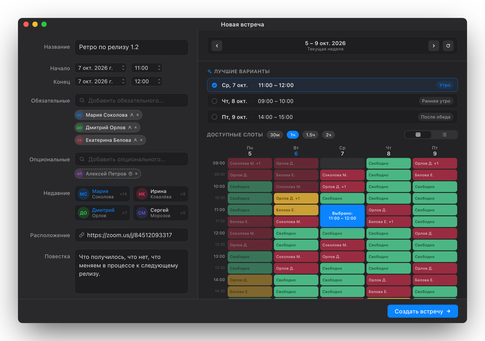
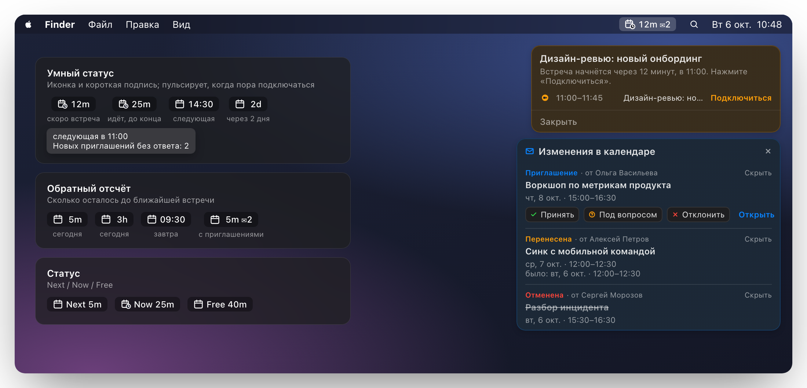
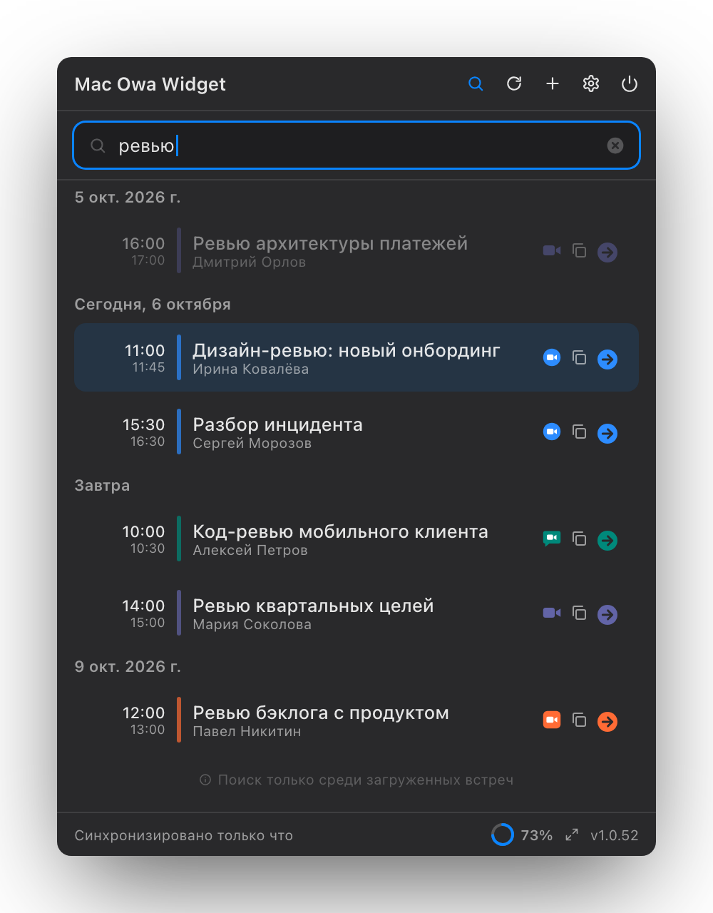
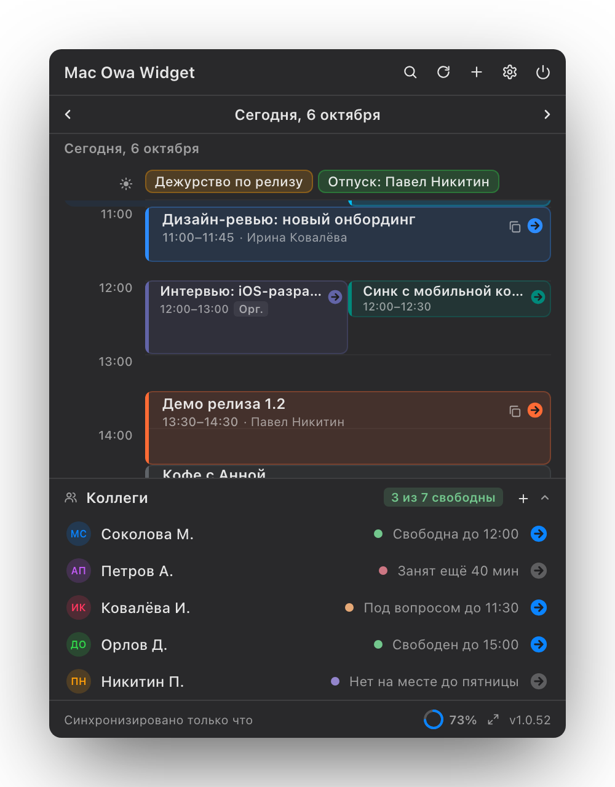
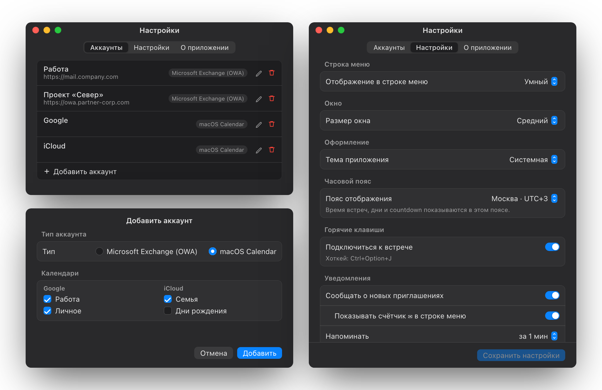

<p align="right"><a href="README.md">English</a> · <b>Русский</b></p>

# OWA Widget



[](#требования)
[](#требования)
[](DEVELOPMENT.md)
[](https://github.com/ilyabazhenov/mac-owa-widget/releases/latest)
[](LICENSE)

**OWA Widget** — приложение для строки меню macOS, которое держит встречи под рукой. Показывает день из Microsoft Exchange / OWA и из любых календарей, которые уже синхронизирует ваш Mac (Google, iCloud, локальные), и подключает к Teams, Zoom, Webex, Google Meet, KTalk и другим звонкам в один клик. Из того же окна можно ответить на приглашение, найти встречу и назначить новую по занятости коллег.

[Скачать последний релиз](https://github.com/ilyabazhenov/mac-owa-widget/releases/latest) · [Сайт](https://ilyabazhenov.github.io/mac-owa-widget/) · [Установка](#установка) · [Частые вопросы](#частые-вопросы)

## Возможности

### Весь день на одном экране



- День в виде таймлайна: пересекающиеся встречи стоят рядом, текущие полчаса подсвечены, прошедшие встречи приглушены.
- Баннер **ближайшей встречи** с обратным отсчётом и кнопкой **Подключиться** — за 30 минут до начала и пока встреча идёт.
- События на весь день (дежурства, отпуска, командировки) закреплены полосой над таймлайном и не теснят встречи.
- Неделя назад и месяц вперёд — стрелками или свайпом двумя пальцами по трекпаду.
- Встречи всех аккаунтов на одном таймлайне: несколько серверов Exchange / OWA плюс календари Google и iCloud.
- Три размера окна (компактный, средний, большой), светлая, тёмная или системная тема, свой часовой пояс отображения.

<br clear="right">

### Всё о встрече в одной карточке



- Полная повестка, а не 255 символов превью от Exchange: таблицы остаются таблицами, списки сохраняют вложенность, `https`-ссылки кликабельны.
- Ответ на приглашение прямо в карточке: **Принять**, **Под вопросом** или **Отклонить**, текущий ответ подсвечен.
- Участники разделены на обязательных и необязательных; длинный список сворачивается и не вытесняет повестку.
- Копирование названия, ссылки на звонок или сразу названия со временем и ссылкой.

<br clear="right">

### Создание встреч по реальной занятости



- Поиск людей в адресной книге Exchange: обязательные и необязательные участники, частые контакты под рукой.
- Сетка занятости на всю неделю по всем участникам: свободно, под вопросом, занято, вне офиса.
- **Лучшие варианты** — по одному удачному слоту на день. Выберите 30 мин, 1 ч, 1.5 ч или 2 ч, и сетка предложит только подходящие окна.
- Можно забронировать время только для себя, без участников. Окно открывается кнопкой **+** или сочетанием **Ctrl+Option+N**.

### Строка меню, которая подскажет, что дальше



- **Умный статус**: иконка и короткая подпись, которые пульсируют, когда пора подключаться. Есть и режимы **обратного отсчёта** и **Next / Now / Free**.
- Напоминания на экране с кнопкой **Подключиться** появляются на том мониторе, где курсор.
- **Изменения в календаре**: новые приглашения, переносы и отмены приходят в панель, из которой можно сразу ответить. Счётчик ✉︎ в строке меню показывает, сколько приглашений ждут ответа.
- **Ctrl+Option+J** подключает к текущей встрече из любого приложения; если стартует несколько, предложит выбрать.
- При сбое синхронизации на иконке появляется значок-предупреждение, причина — во всплывающей подсказке.

### Поиск и коллеги

<table>
<tr>
<td width="50%"></td>
<td width="50%"></td>
</tr>
<tr>
<td valign="top">Поиск по названию, организатору, участникам, месту и описанию среди всех загруженных встреч — от недели назад до месяца вперёд. Результаты сгруппированы по дням, у каждой строки есть кнопка подключения.</td>
<td valign="top">Коллеги, с которыми вы созваниваетесь чаще всего, — внизу окна: видно, кто свободен, занят или отсутствует, и можно сразу зайти в его личную комнату Teams или Zoom.</td>
</tr>
</table>

### Exchange, Google и iCloud вместе



- **Microsoft Exchange / OWA**: Exchange 2016, 2019 и Exchange Online, в том числе серверы, перешедшие на единый вход Windows (NTLM). Несколько аккаунтов одновременно.
- **Календарь macOS**: любые календари, которые уже синхронизирует Mac (Google, iCloud, локальные, другие учётные записи интернета). Выберите нужные — их встречи появятся рядом с встречами из OWA, вместе со ссылками на звонок.
- Настройки режима строки меню, размера окна, темы, часового пояса, напоминаний, хоткея подключения и уведомлений о приглашениях.

### Приватность по умолчанию

- Пароли хранятся в связке ключей macOS. Список аккаунтов, кэш встреч и история участников зашифрованы на диске ключом из связки ключей.
- Только HTTPS и привязка сертификата к серверу. Недоверенный или сменившийся сертификат, как и вход, перенаправленный на другой адрес, требуют вашего подтверждения.
- Учётные данные уходят только на тот сервер, который вы указали. В диагностических логах нет названий встреч, адресов, паролей и ответов сервера.
- Обновления подписаны и устанавливаются внутри приложения через [Sparkle](https://sparkle-project.org).

## Требования

| Что нужно | Версия |
|---|---|
| macOS | 13 Ventura или новее, Apple Silicon или Intel |
| Календарь | Exchange 2016, 2019 или Exchange Online и/или календари, синхронизированные macOS (Google, iCloud) |
| Доступ к сети | Напрямую к Exchange или через корпоративный VPN (для календарей macOS не нужен) |

## Установка

1. Откройте [последний релиз](https://github.com/ilyabazhenov/mac-owa-widget/releases/latest).
2. Скачайте `.zip` архив для macOS.
3. Распакуйте архив и перенесите `OWAWidget.app` в `/Applications`.
4. Если macOS блокирует первый запуск, один раз снимите quarantine-атрибут:

```bash
xattr -dr com.apple.quarantine /Applications/OWAWidget.app
```

5. Запустите приложение:

```bash
open /Applications/OWAWidget.app
```

OWA Widget появится в строке меню. Иконки в Dock нет.

Команда снятия quarantine нужна только при первой установке. Все последующие обновления ставятся через Sparkle автоматически.

## Первый запуск

1. Нажмите на иконку OWA Widget в строке меню и откройте **Настройки**.
2. На вкладке **Аккаунты** нажмите **+** и выберите тип аккаунта.

**Microsoft Exchange (OWA)**

3. Укажите URL сервера, учётную запись, пароль и название аккаунта.
   - URL сервера обычно совпадает с адресом корпоративной почты в браузере: `mail.company.com`, `https://owa.company.com` или `https://outlook.company.com/owa`.
   - Если в компании вход через единый вход Windows, укажите учётную запись в формате `ДОМЕН\логин` и пароль от компьютера.
4. Нажмите **Проверить подключение**, затем **Добавить**. Если Exchange доступен только из внутренней сети, сначала подключитесь к VPN.

**Календарь macOS (Google, iCloud, локальные)**

3. Разрешите доступ к Календарю, когда macOS спросит.
4. Отметьте нужные календари и нажмите **Добавить**. Календари берутся из **Системные настройки › Учётные записи интернета**; если список пуст, добавьте туда аккаунт Google или iCloud.

Разрешите уведомления, когда macOS спросит, чтобы получать напоминания перед встречами.

## Обновления

OWA Widget обновляется через [Sparkle](https://sparkle-project.org).

- Когда выходит новая версия, в окне приложения появляется кнопка **Установить**.
- Приложение скачивает обновление, проверяет подпись, заменяет bundle и перезапускается.
- Автопроверку можно отключить в **Настройки › Настройки › Обновления**.

## Частые вопросы

**Где взять URL OWA-сервера?**

Это адрес, по которому вы открываете корпоративную почту в браузере. Если сомневаетесь, спросите IT-отдел.

**Нужен ли VPN?**

Для Exchange / OWA, доступного только из корпоративной сети, — да: приложение должно видеть тот же сервер, что и браузер. Календари Google и iCloud работают без VPN.

**Можно ли пользоваться без Exchange?**

Да. Добавьте аккаунт **macOS Calendar**, и виджет покажет календари, которые синхронизирует ваш Mac. В приложении они доступны только для чтения: ответы на приглашения, создание встреч и раздел «Коллеги» работают с аккаунтом Exchange / OWA.

**Зачем macOS спрашивает доступ к Календарю?**

Разрешение нужно только для чтения календарей Google, iCloud и локальных. Если вы пользуетесь только Exchange / OWA, его можно не давать. После обновления приложения macOS может спросить снова — достаточно подтвердить.

**Где хранится пароль?**

В связке ключей macOS. В настройки и другие файлы он в открытом виде не попадает.

**Почему macOS блокирует первый запуск?**

Приложение распространяется без подписи Apple Developer ID, поэтому Gatekeeper может пометить первый скачанный bundle как quarantined. Снимите атрибут один раз командой из раздела [Установка](#установка).

**Почему у встречи нет кнопки подключения?**

Кнопка появляется, когда приложение находит ссылку на звонок в поле онлайн-встречи, в месте или в описании. Проверьте, что организатор добавил ссылку.

## Диагностика

При каждом запуске OWA Widget пишет короткий лог событий жизненного цикла (запуск, иконка в строке меню, состояние аккаунтов, ошибки синхронизации). В нём нет названий встреч, email-адресов и паролей — только метаданные.

```text
~/Library/Application Support/OWAWidget/diagnostic.log           # текущая сессия
~/Library/Application Support/OWAWidget/diagnostic.previous.log  # предыдущая сессия
```

- **Иконка в строке меню видна:** правый клик по ней → **Скопировать диагностику**. Отчёт окажется в буфере обмена.
- **Иконки нет:** в Finder нажмите `⌘⇧G` и вставьте путь выше или выполните:

```bash
open ~/Library/Application\ Support/OWAWidget/diagnostic.log
```

Приложите содержимое к багрепорту — обычно этого достаточно, чтобы понять, где запуск или синхронизация пошли не так.

## Разработка

Сборка из исходников, архитектура, скриншоты и релизы описаны в [DEVELOPMENT.md](DEVELOPMENT.md).

## Лицензия

[MIT](LICENSE)
